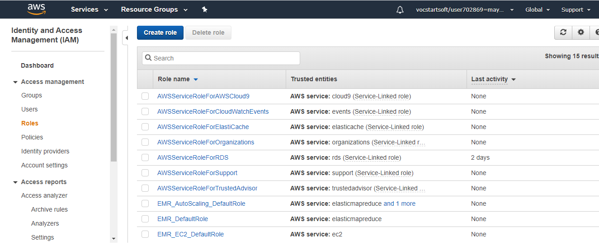

# **SETTING S3 BUCKET TRIGGER ON LAMBDA**

### STEP 1:-

### STEP 2:-

### STEP 3:-

### STEP 4:-

### STEP 5:-

### STEP 6:-

### STEP 7:-

### STEP 8:-

### STEP 9:-

### STEP 10:-

### STEP 11:-

### STEP 12:-

### STEP 13:-

### STEP 14:-

### STEP 15:-

### STEP 16:-

### STEP 17:-

### STEP 18:-

### STEP 19:-

### STEP 20:-

### STEP 21:-

### STEP 22:-

